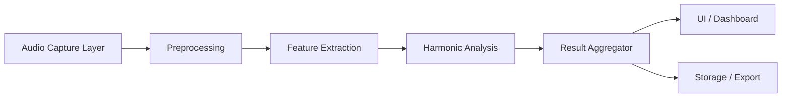

# Windows Audio Analyzer – Grundarchitektur

**Datum:** 2026-07-12  
**Ziel:** Ein Windows-Tool, das aus einem Audiostream Tonart, Akkorde und Einzelnoten erkennt und live anzeigt.

---

## 1. Zielbild

Der Audio Analyzer soll als modularer Windows-Desktop-Stack aufgebaut werden, der:

- Audio aus Mikrofon oder Loopback erfasst
- Frequenzinhalt und Tonhöhen extrahiert
- Tonart, Akkorde und Einzelnoten erkennt
- Ergebnisse in Echtzeit im UI anzeigt
- später optional exportiert oder gespeichert werden kann

---

## 2. Architekturprinzipien

- Trennung von Aufnahme, Signalverarbeitung, Analyse und Darstellung
- Echtzeitfähigkeit mit klaren Performance-Grenzen
- Austauschbare Komponenten für verschiedene Analyse-Methoden
- Windows-optimiert mit nativer Audio-Integration
- klare Event- und Datenströme zwischen Modulen

---

## 3. Gesamtarchitektur



---

## 4. Kernmodule

### 4.1 Audio Capture Layer

**Verantwortung:** Aufnahme von Audiodaten aus Windows.

Empfohlene Technologien:

- Windows WASAPI für Mikrofon oder Loopback
- optional ASIO für professionelle Low-Latency-Aufnahme

Aufgaben:

- Audio-Stream öffnen
- Frames in kleinen Blöcken lesen
- Format normalisieren (z. B. 16 kHz / mono)
- Rohdaten an Preprocessing weitergeben

### 4.2 Preprocessing

**Verantwortung:** Rohsignal für Analyse vorbereiten.

Aufgaben:

- Entzerrung / Normalisierung
- Rauschfilterung
- Fensterung (z. B. Hann Window)
- Downsampling / Resampling

### 4.3 Feature Extraction

**Verantwortung:** Frequenz- und Toninformationen aus dem Signal gewinnen.

Wichtige Schritte:

- FFT / Spectrogramm
- Pitch-Tracking
- Onset-Erkennung
- Chroma-Features
- Energiemessungen pro Frequenzband

### 4.4 Harmonic Analysis

**Verantwortung:** aus den Extraktionen Tonart, Akkorde und Einzelnoten ableiten.

Komponenten:

- Tonhöhenerkennung für Einzelnoten
- Akkordklassifikation über Intervalle und Chroma-Muster
- Tonartenbestimmung über tonale Schwerpunktanalyse
- Zustandsmaschine für stabile Ergebnisse über Zeit

### 4.5 Result Aggregator

**Verantwortung:** Rohanalysen in konsistente, UI-taugliche Ergebnisse bündeln.

Beispiele:

- aktuelle Tonart: `D minor`
- aktueller Akkord: `Dm`
- letzte Noten: `D4, F4, A4`
- Vertrauenswerte und Stabilität

### 4.6 UI / Dashboard

**Verantwortung:** Live-Anzeige und Interaktion.

Darstellung:

- Live-Spektrum
- aktuelle Tonart
- aktueller Akkord
- erkannte Einzelnoten
- Verlauf / Historie
- Konfigurationspanel für Sensitivität und Sampling

### 4.7 Storage / Export

**Verantwortung:** Analyseergebnisse dauerhaft machen.

Optional später:

- JSON/CSV-Export
- Session-Logging
- Audio-Clip-Annotationen

---

## 5. Datenfluss

```text
Audio Input
  -> Capture Buffer
  -> Preprocessing
  -> FFT / Pitch / Onset Extraction
  -> Harmonic Classification
  -> Aggregated Analysis Result
  -> UI Update + History + Export
```

---

## 6. Empfohlene technische Basis

Für eine Windows-native Umsetzung ist folgende Kombination sinnvoll:

- **Sprache / Runtime:** C# mit .NET 8
- **UI:** WinUI 3 oder WPF
- **Audio-Integration:** NAudio
- **DSP / Analyse:** eigene Signalverarbeitung oder Library-Ansätze wie NAudio + FFT-Implementierung
- **Modellierung:** klare Service- und Interface-Schicht

---

## 7. Modulstruktur (konzeptionell)

```text
AudioAnalyzer.App
├── Audio
│   ├── CaptureService
│   ├── AudioBuffer
│   └── AudioFormat
├── Processing
│   ├── Preprocessor
│   ├── FeatureExtractor
│   ├── PitchTracker
│   └── ChordDetector
├── Analysis
│   ├── KeyDetector
│   ├── ChordClassifier
│   └── NoteTracker
├── Core
│   ├── AnalysisSession
│   ├── ResultModel
│   └── EventBus
├── UI
│   ├── MainWindow
│   ├── SpectrumView
│   ├── AnalysisPanel
│   └── SettingsPanel
└── Storage
    └── ExportService
```

---

## 8. Beispiel für die Result-Modelle

```csharp
public sealed record AnalysisResult(
    string CurrentKey,
    string CurrentChord,
    IReadOnlyList<string> ActiveNotes,
    double Confidence,
    DateTimeOffset Timestamp
);
```

---

## 9. MVP-Umfang

Die erste Version sollte sich auf Folgendes konzentrieren:

- Live-Mikrofon- oder Loopback-Aufnahme
- erkennbare Einzelnoten
- einfache Akkord-Erkennung
- Tonarten-Erkennung auf Basis einer stabilen Zeitfenster-Logik
- einfache Live-Anzeige im UI

---

## 10. Erweiterungsmöglichkeiten

Später sinnvoll:

- Mehrspurigkeit
- MIDI-Ausgabe
- Notenblatt-ähnliche Darstellung
- Trainingsmodus für Musiktheorie
- Export von Sessions als MIDI/JSON
- Plugin-Architektur für unterschiedliche Analyse-Algorithmen

---

## 11. Empfehlung

Die beste Grundarchitektur ist eine klare Pipeline mit vier Schichten:

1. Audio-Eingang
2. Signalverarbeitung
3. Harmonic Analysis
4. UI / Ausgabe

Diese Struktur ist robust, erweiterbar und passt gut zu einer Windows-Desktop-Anwendung mit Echtzeit-Anforderungen.
