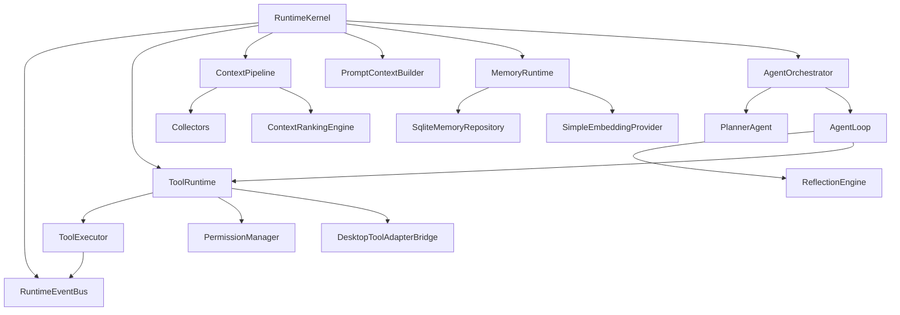
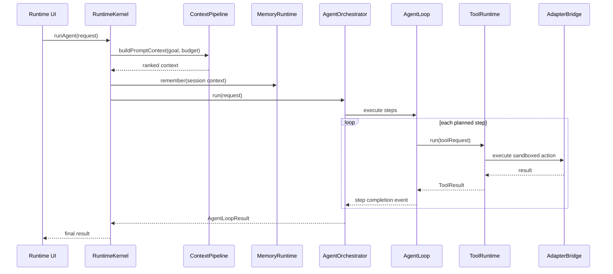

# Codee Runtime Architecture (Tool, Context, Agent, Memory)

## Goals

- Local-first runtime orchestration with strict process and permission boundaries.
- Provider-independent agent execution via typed runtime contracts.
- Safe editing lifecycle with preview, approval, and restore points.
- Reusable runtime modules with explicit interfaces and event-driven composition.

## Folder Structure

```text
apps/desktop/src/runtime/
  agent/
    agentContracts.ts
    plannerAgent.ts
    reflectionEngine.ts
    agentLoop.ts
    agentOrchestrator.ts
  context/
    contextContracts.ts
    contextCollectors.ts
    contextRankingEngine.ts
    contextPipeline.ts
    promptContextBuilder.ts
  core/
    runtimeEventBus.ts
  memory/
    memoryContracts.ts
    memoryExtractionPipeline.ts
    sqliteMemoryRuntime.ts
    simpleEmbeddingProvider.ts
    memoryRuntime.ts
  tool/
    toolContracts.ts
    toolRegistry.ts
    permissionManager.ts
    errorNormalization.ts
    toolAdapterBridge.ts
    toolExecutor.ts
    toolRuntime.ts
  runtimeKernel.ts
```

## Runtime Dependency Graph



## Event Flow



## Security and Permission Model

- Agents do not directly access filesystem, terminal, git, or network APIs.
- All side effects are routed through Tool Runtime with:
  - typed request schema validation (`zod`)
  - scope-based permission checks (`PermissionManager`)
  - timeout and cancellation controls (`ToolExecutor`)
  - structured error normalization for deterministic recovery
- Electron bridge remains the sole host boundary for privileged operations.
- Workspace path constraints are enforced in existing workspace and file-change services.

## Patch/Diff Lifecycle

1. Agent requests `apply_patch` in preview mode.
2. Bridge calls workspace diff API and receives `{snapshotId, beforeContent, afterContent, diff}`.
3. Agent runtime requests approval if policy requires it.
4. On approval, patch is applied via safe patch API with restore metadata.
5. Restore points and snapshot IDs provide reversible operations.

## Data Flow Summary

- Context Runtime:
  - Collects active file, open tabs, diagnostics, git state, and workspace structure.
  - Ranks by relevance and token budget.
  - Produces model-ready context blocks.
- Agent Runtime:
  - Plans steps from user goal and mode.
  - Executes tools under policy budgets.
  - Reflects on results and retries within limits.
- Memory Runtime:
  - Stores session/project memories in local SQLite schema.
  - Generates embeddings through pluggable provider.
  - Supports vector similarity retrieval for future context expansion.

## Implementation Phases

1. Foundation (done)
- Event bus, tool contracts, registry, permissions, executor, bridge.
- Context contracts, collectors, ranking, pipeline, prompt builder.

2. Agent Core (done)
- Planner, reflection, loop execution, orchestrator, policy budgets.
- Approval gate for patch workflows.

3. Memory Core (done)
- Repository abstraction and SQLite-backed implementation.
- Extraction pipeline and embedding provider.

4. Runtime Composition (done)
- Unified `RuntimeKernel` with lifecycle `initialize` and `runAgent`.

5. Hardening (next)
- Replace heuristic tool-input builder with model/tool planner output.
- Add IPC-facing runtime service bindings and UI wiring for approvals.
- Expand tests for bridge and failure injection scenarios.

6. Production Security (next)
- Add explicit allowlist for terminal commands and per-workspace policy profiles.
- Add signed audit stream export and tamper-evident run logs.
