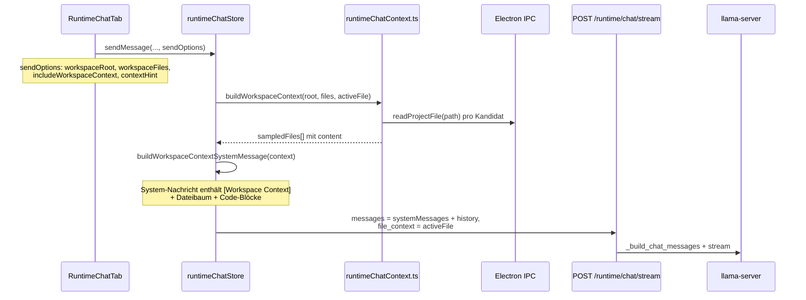

# Runtime Chat — Projektkontext Abnahme (Golden Path)

Stand: 2026-06-18

Präziser Abnahmeablauf dafür, dass der **Runtime Chat** den **offenen Workspace** (Dateibaum, gesampelte Dateiinhalte, aktive Editor-Datei) an das lokale Modell übergibt.

**Scope:** Embedded Panel (rechts) und detached Fenster (`?view=runtime-chat`).

**Nicht im Scope:** Phase 1A Context Pack Builder, Vektor-Memory, vollständiger Repo-Index.

---

## 1. Architektur (Datenfluss)



### Relevante Module

| Schicht | Datei | Verantwortung |
|---------|-------|---------------|
| UI | `apps/desktop/src/components/RuntimeChatTab.tsx` | Checkbox **Kontext**, `sendOptions`, Chip-Zeile `{activeFile} · {workspaceName}` |
| Store | `apps/desktop/src/stores/runtimeChatStore.ts` | Lädt Kontext, baut `systemMessages`, sendet Request |
| Kontext-Builder | `apps/desktop/src/services/runtimeChatContext.ts` | Dateiauswahl, Lesen, `buildWorkspaceContextSystemMessage()` |
| Sync (detached) | `apps/desktop/src/App.tsx` | `publishRuntimeChatContext({ … workspaceFiles })` |
| IPC | `apps/desktop/electron/main.ts` | `runtimeChatContext` Snapshot broadcast |
| Backend | `backend/app/runtime/service.py` | `_build_chat_messages`: DBZS-Prompt + `file_context` + `messages` |

### Harte Limits (Konstanten)

| Konstante | Wert | Bedeutung |
|-----------|------|-----------|
| `MAX_SAMPLED_FILES` | 6 | Max. Dateien mit Inhalt im Kontext |
| `MAX_SAMPLED_FILE_CHARS` | 2 000 | Zeichen pro gesampelter Datei |
| `MAX_WORKSPACE_TREE_FILES` | 80 | Einträge im Dateibaum |
| Dateibaum in System-Nachricht | 40 | Vorschau-Zeilen in `[Workspace Context]` |
| `MAX_CONTEXT_CHARS` (aktive Datei) | 16 000 | `file_context` separat ans Backend |
| `MAX_HISTORY_MESSAGES` | 12 | Chat-Verlauf in der Anfrage |

### Priorisierte Kontext-Dateien (`pickContextFiles`)

1. Aktive Editor-Datei (falls im Workspace)
2. Wichtige Root-Dateien: `README.md`, `AGENTS.md`, `package.json`, `pyproject.toml`, …
3. Entrypoints: `main|app|index|config|settings.(py|ts|tsx|js|json)`

Ausgeschlossen: `.git`, `node_modules`, `dist`, `build`, `.venv`, …

---

## 2. Voraussetzungen (alle müssen erfüllt sein)

| # | Check | Wie prüfen | Erwartung |
|---|-------|------------|-----------|
| P1 | Repo-Root als Workspace | Menü / Workspace-Panel | Projektname sichtbar, nicht „—“ |
| P2 | Dateiscan abgeschlossen | Explorer / Sidebar | Dateiliste nicht leer |
| P3 | Runtime läuft | Runtime Chat Kopfzeile | Status **nicht** „Runtime offline“; Modellname sichtbar |
| P4 | Golden Path Runtime | `docs/LOCAL_ACCEPTANCE.md` Phase 0.4 | `POST /runtime/chat` liefert echte Antwort |
| P5 | Checkbox **Kontext** | Composer-Zeile unten | Häkchen gesetzt (Default: **an**) |
| P6 | Modus **Auto** (für Basistest) | Composer | „Auto“ aktiv, nicht „Agent“ (Agent = Turn-Loop, separates Szenario) |

**Minimaler automatisierter Gate vor manueller UI-Abnahme:**

```powershell
cd c:\Users\ralle\source\repos\dbzs-codee-project\apps\desktop
pnpm exec vitest run src/components/RuntimeChatTab.test.ts
```

Erwartung: 8/8 Tests grün (inkl. `buildWorkspaceContextSystemMessage` mit Dateiinhalt).

---

## 3. UI-Vorbereitung (Schritt für Schritt)

1. App starten: `pnpm --filter @dbzs/desktop dev`
2. Workspace öffnen: **dieses Repo** (`dbzs-codee-project`)
3. Warten bis Scan im Log / Explorer Dateien zeigt (typisch > 100 Einträge)
4. Optional: `README.md` oder `AGENTS.md` im Editor öffnen (aktive Datei)
5. Runtime starten (Mission Control oder Runtime-Panel) — warten bis `state=running`
6. Rechts **Runtime Chat** öffnen (nicht detached)
7. Button **Panel** oben rechts klicken → Activity-Panel sichtbar
8. Prüfen: Chip-Zeile zeigt `{Dateiname oder „keine Datei“} · {Projektname}` — **nicht** `· —`

---

## 4. Abnahme-Szenarien

### Szenario A — Embedded Chat, README-Inhalt (Haupttest)

**Ziel:** Modell kann Inhalt aus einer gesampelten Projektdatei wiedergeben.

| Schritt | Aktion | Erwartung (PASS) |
|---------|--------|------------------|
| A1 | Prompt senden (exakt): `Zitiere wörtlich die erste Überschrift aus unserer README.md — nur die Überschrift, nichts erfinden.` | Nachricht erscheint als „Du“ |
| A2 | Activity-Panel während Senden beobachten | Schritt **Workspace-Kontext laden** → Summary: `N Dateien geladen` mit **N ≥ 1** |
| A2a | Details aufklappen | Zeilen `✓ README.md (markdown, … Zeichen)` **oder** `✓ AGENTS.md …` |
| A3 | Schritt **Anfrage vorbereiten** | Detail enthält `… Kontextnachrichten` mit Zahl **≥ 1** |
| A4 | Schritt **Aktive Datei** | Entweder Dateiname + Zeichenzahl **oder** „Keine Datei im Editor aktiv“ |
| A5 | Assistant-Antwort lesen | Enthält echte README-Überschrift (z. B. projektspezifischer Titel) — **keine** generische Erfindung |
| A6 | Negativkontrolle | Antwort erwähnt **nicht** „ich habe keinen Zugriff auf Dateien“ |

**FAIL-Kriterien:** Activity zeigt „Workspace-Kontext · Nicht eingebunden“; N = 0 trotz offenem Projekt; Modell antwortet nur mit Platzhalter.

---

### Szenario B — Activity-Details (technische Sichtbarkeit)

Nach A1, Activity-Run aufklappen:

| Schritt-ID | Label | Erwarteter Status | Erwartetes Detail (Muster) |
|------------|-------|-------------------|----------------------------|
| `workspace-context` | Workspace-Kontext laden | ✓ done | `{n} Dateien geladen` |
| — | (Detail) | — | `Workspace {name}: {k} Kandidaten, {t} Dateien im Baum` |
| — | (Detail) | — | `Lese README.md ...` / `✓ README.md (markdown, {chars} Zeichen)` |
| `file-context` | Aktive Datei | ✓ done | `{name} (...)` oder „Keine Datei …“ |
| `history` | Anfrage vorbereiten | ✓ done | `{h} Verlaufsnachrichten, {s} Kontextnachrichten` mit **s ≥ 1** |
| `llm-request` | Modell-Anfrage senden | ✓ done | Streaming abgeschlossen |

---

### Szenario C — Checkbox „Kontext“ aus (Negativtest)

| Schritt | Aktion | Erwartung |
|---------|--------|-----------|
| C1 | **Kontext** abhaken | Checkbox leer |
| C2 | Gleichen Prompt wie A1 senden | Activity: **Workspace-Kontext · Nicht eingebunden** |
| C3 | Antwort | Modell **kann** README nicht zuverlässig zitieren (halluziniert oder lehnt ab) |
| C4 | **Kontext** wieder anhaken | — |

---

### Szenario D — Kein Workspace (Negativtest)

| Schritt | Aktion | Erwartung |
|---------|--------|-----------|
| D1 | Workspace schließen / kein Projekt | Chip-Zeile: `keine Datei · —` |
| D2 | Prompt senden | Activity: **Workspace-Kontext · Nicht eingebunden** |
| D3 | Antwort | Kein projektspezifischer Dateiinhalt |

---

### Szenario E — Detached Fenster (IPC-Sync)

| Schritt | Aktion | Erwartung |
|---------|--------|-----------|
| E1 | Im Hauptfenster: Projekt offen, README geladen, Runtime running | Chip zeigt Projektname |
| E2 | Runtime Chat → Pop-out (separates Fenster) | Zweites Fenster öffnet sich |
| E3 | Chip-Zeile im detached Fenster | **Gleicher** Projektname wie Hauptfenster |
| E4 | Prompt wie A1 senden | Activity: `N Dateien geladen`, N ≥ 1 |
| E5 | Im Hauptfenster andere Datei aktivieren | Nach erneutem Fokus/Sync: detached zeigt neuen Dateinamen im Chip |

**Hintergrund:** `publishRuntimeChatContext` sendet jetzt auch `workspaceFiles` (Metadaten-Liste). Ohne diese Liste war detached der häufigste Grund für „kein Kontakt zum Projektkontext“.

---

### Szenario F — @-Mention (optional)

| Schritt | Aktion | Erwartung |
|---------|--------|-----------|
| F1 | Im Composer tippen: `@file:docs/` | Mention-Vorschläge erscheinen |
| F2 | Datei wählen, Frage stellen | Zusätzlicher `[Mention Context]`-Block in Kontextnachrichten (Activity: höhere Kontextnachrichten-Zahl) |

---

### Szenario G — Agent-Modus + Tools (optional, erweitert)

| Schritt | Aktion | Erwartung |
|---------|--------|-----------|
| G1 | Modus **Agent**, Profil **Ask** | — |
| G2 | Frage: `Liste die Top-Level-Ordner in unserem Projekt.` | Turn-Loop startet (Activity: **Agent-Turn starten**) |
| G3 | Antwort | Ordnernamen passen zum Repo (z. B. `apps`, `backend`, `docs`, …) |

---

## 5. Request-Inhalt (was technisch ans Modell geht)

Bei **Auto**-Modus und llama-cpp-Provider:

```text
[System] DBZS Code Assistant (Backend, service.py)
[System] Aktive Datei + Inhalt          ← nur wenn Editor-Tab offen (file_context)
[System] Skills / Tools / contextHint   ← falls aktiv
[System] [Workspace Context]              ← Dateibaum + Code-Blöcke (Frontend)
[System] [Project Memory] / [Code Index]  ← optional
[User]    … Verlauf …
[User]    aktuelle Frage
```

Die System-Nachricht `[Workspace Context]` **muss** folgende Struktur enthalten (ab Fix 2026-06-18):

```text
[Workspace Context]
Name: dbzs-codee-project
Root: C:\...\dbzs-codee-project

Project file tree (preview):
- README.md
- package.json
…

Project file contents:
### README.md (markdown)
```markdown
… echter Inhalt …
```
```

**Vor dem Fix** stand unter „Sampled files“ nur eine Pfadliste — das Modell sah **keinen** Dateiinhalt. Abnahme prüft deshalb Inhalts-Zitate (Szenario A), nicht nur Ordnernamen.

---

## 6. Manuelle Netzwerk-Prüfung (optional, sehr genau)

1. DevTools im Electron-Hauptfenster öffnen (falls verfügbar) oder Backend-Log
2. Beim Senden: Request an `http://127.0.0.1:8876/runtime/chat/stream`
3. Body `messages` durchsuchen:
   - Ein `role: "system"`-Eintrag mit `"[Workspace Context]"`
   - Darin Substring aus bekannter README-Zeile
4. Separates Feld `file_context`: nur gesetzt wenn Editor-Tab aktiv

---

## 7. Abnahme-Checkliste (Kurz)

| ID | Szenario | PASS | FAIL | Datum | Prüfer |
|----|----------|------|------|-------|--------|
| A | README-Zitat embedded | ☐ | ☐ | | |
| B | Activity-Schritte vollständig | ☐ | ☐ | | |
| C | Kontext aus → kein Kontext | ☐ | ☐ | | |
| D | Kein Workspace | ☐ | ☐ | | |
| E | Detached IPC | ☐ | ☐ | | |
| F | @-Mention | ☐ | ☐ | | |
| G | Agent-Modus | ☐ | ☐ | | |
| UT | Vitest `RuntimeChatTab.test.ts` 8/8 | ☐ | ☐ | | |

**Gesamt PASS:** A + B + C + E + UT müssen grün sein. D und C bestätigen Negativpfade.

---

## 8. Fehlerdiagnose (Entscheidungsbaum)

```
Antwort ohne Projektbezug?
├─ Chip-Zeile zeigt „· —“
│  └─ Kein Workspace → Projekt öffnen, scanFiles abwarten
├─ Checkbox „Kontext“ aus?
│  └─ aktivieren
├─ Activity: „Nicht eingebunden“
│  ├─ workspaceRoot null → Workspace-State prüfen (Settings / IPC)
│  ├─ detached + workspaceFiles leer → Hauptfenster fokussieren, erneut pop-out
│  └─ readProjectFile fehlgeschlagen → Details mit „✗ … (Lesefehler)“ → Pfad/Rechte
├─ Activity: „0 Dateien geladen“
│  └─ Scan leer oder nur ausgeschlossene Ordner → Projekt neu scannen
├─ Activity: N ≥ 1, Modell halluziniert trotzdem
│  ├─ Kleines Modell / kurzer Kontext → README-Frage vereinfachen
│  └─ Prüfen ob `[Workspace Context]` Code-Blöcke enthält (Abschn. 5)
└─ Runtime offline / 409
   └─ docs/LOCAL_ACCEPTANCE.md Phase 0.4
```

---

## 9. Verwandte Dokumente

- [`LOCAL_ACCEPTANCE.md`](LOCAL_ACCEPTANCE.md) — Runtime Golden Path (Doctor → Chat API)
- [`RUNTIME_DOCTOR.md`](RUNTIME_DOCTOR.md) — Modell-Diagnose
- [`RUNTIME-MANAGEMENT.md`](RUNTIME-MANAGEMENT.md) — Chat-API-Referenz
- [`HANDOVER_AGENTIC_RUNTIME_CHAT.md`](HANDOVER_AGENTIC_RUNTIME_CHAT.md) — Agent-Turn-Loop
